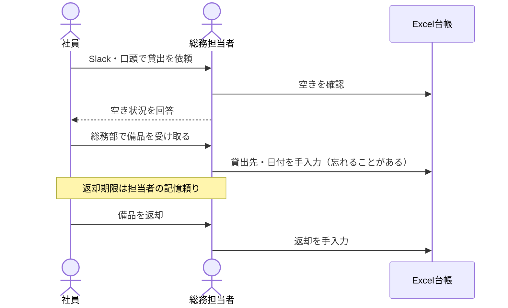
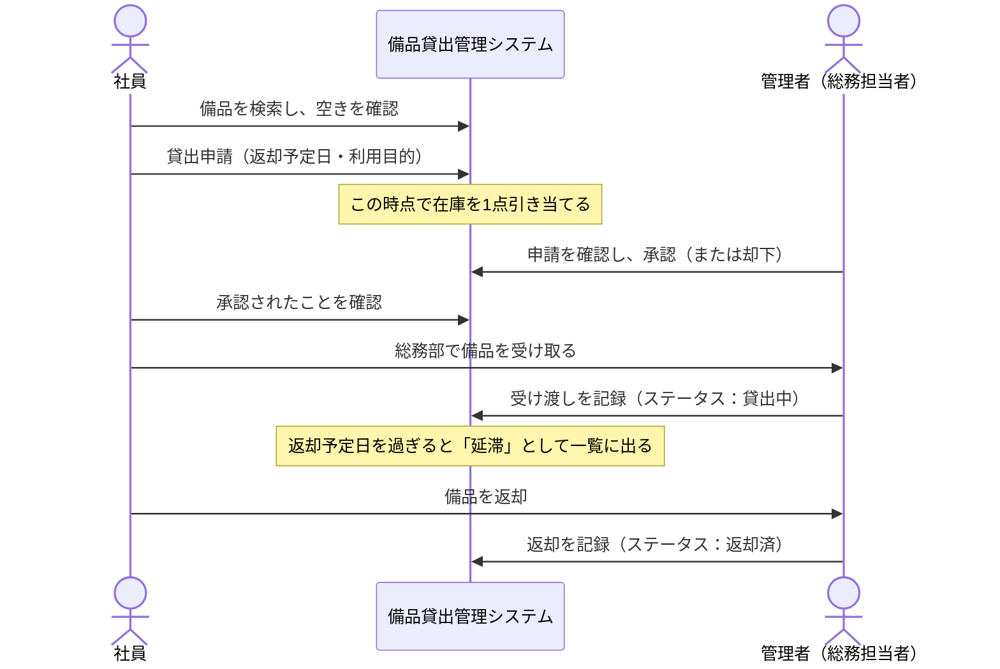
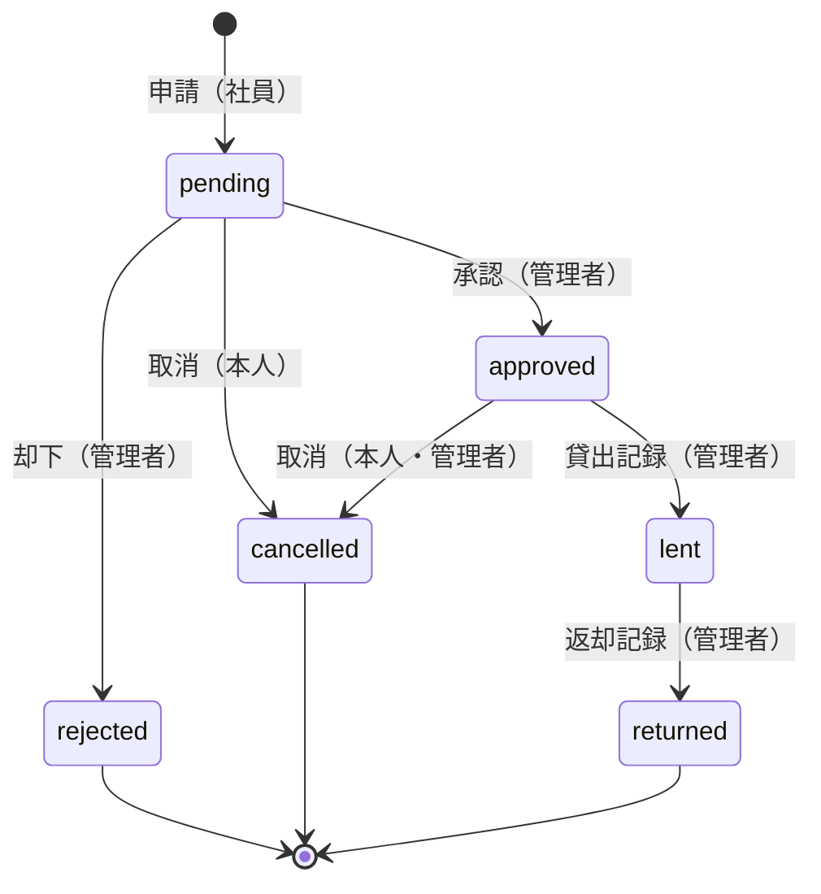

# 要件定義書

| 項目           | 内容                                        |
| -------------- | ------------------------------------------- |
| システム名     | 備品貸出管理システム                        |
| 依頼元         | 株式会社ノースブリッジ 総務部（架空の会社） |
| 文書バージョン | 0.1（ドラフト）                             |
| 作成日         | 2026-09-13                                  |
| 作成者         | 開発チーム リーダー                         |

## 改訂履歴

| 版  | 日付       | 内容     | 作成者   |
| --- | ---------- | -------- | -------- |
| 0.1 | 2026-09-13 | 初版作成 | リーダー |

---

## 1. はじめに

### 1.1 本書の目的

本書は、株式会社ノースブリッジ（以下「依頼元」）における備品貸出業務のシステム化について、依頼元と開発チームの間で合意した要件を定義する。
設計・実装・テストは本書を基準に行う。

### 1.2 対象読者

- 依頼元 総務部（業務要件の確認）
- 開発チーム（設計・実装・テスト）

### 1.3 関連文書

- [02 非機能要件定義書](02_non_functional_requirements.md)
- [03 画面一覧・画面遷移](03_screen_list.md)
- [05 テーブル定義書](05_table_definitions.md)
- [06 API設計書](06_api_design.md)

---

## 2. プロジェクト概要

### 2.1 依頼元の概要

| 項目           | 内容                           |
| -------------- | ------------------------------ |
| 会社名         | 株式会社ノースブリッジ（架空） |
| 事業内容       | 業務システムの受託開発         |
| 従業員数       | 82名（2026年9月時点）          |
| 拠点           | 本社1拠点（東京）              |
| 備品管理の担当 | 総務部 2名                     |

### 2.2 現状の業務（As-Is）

- 備品台帳は総務部が Excel で管理し、社内の共有フォルダに置いている。登録点数は約450点（ノートPC、モニター、周辺機器、技術書、モバイルWi-Fiなど）。
- 社員は、借りたい備品があると Slack の DM か口頭で総務部に依頼する。
- 総務担当者は台帳で空きを確認し、備品を手渡して、台帳に貸出先と日付を手入力する。
- 返却時は、社員が総務部に備品を持参し、総務担当者が台帳を更新する。

### 2.3 現状の課題

| No  | 課題                       | 具体的な状況                                                                                |
| --- | -------------------------- | ------------------------------------------------------------------------------------------- |
| 1   | 備品の所在が分からない     | 2025年度の棚卸しで所在不明が6点発生した（うちノートPC 1台）。                               |
| 2   | 在庫確認の問い合わせが多い | 「〇〇は空いていますか」という問い合わせへの対応に、総務担当者が週あたり約3時間使っている。 |
| 3   | 返却期限を管理できていない | 返却期限の管理が担当者の記憶頼りで、期限超過に気付くのが遅れる。                            |
| 4   | 記録が漏れる               | 口頭の依頼で台帳への記入を忘れることがあり、誰がいつ借りたかを追えない。                    |
| 5   | 台帳が壊れる               | Excel を複数人で同時に編集して、上書きが起きたことがある。                                  |

### 2.4 目的

備品の貸出申請から返却までをシステム上で完結させ、**「どの備品を、誰が、いつまで借りているか」を常に正しく把握できる状態**にする。

### 2.5 成功基準（KPI）

リリースから3か月後に以下を満たすことを目標とする。

| No  | 指標                         | 現状                   | 目標                                         |
| --- | ---------------------------- | ---------------------- | -------------------------------------------- |
| 1   | 棚卸し時の所在不明点数       | 6点／年                | 0点                                          |
| 2   | 在庫確認の問い合わせ対応時間 | 週3時間                | 週0.5時間以下                                |
| 3   | 延滞の把握                   | 気付くまで数日〜数週間 | 返却予定日の翌日に、管理者が一覧で確認できる |
| 4   | 申請から承認までの時間       | 計測なし               | 1営業日以内（中央値）                        |

### 2.6 スコープ

#### 対象

- 社員のログイン・ログアウト
- 備品の検索・閲覧
- 貸出申請・承認・受け渡し・返却の記録
- 備品情報の登録・編集・削除（管理者）
- 管理者向けダッシュボード・操作履歴

#### 対象外（将来対応の候補）

| 項目                                             | 理由・代替手段                                                                                                         |
| ------------------------------------------------ | ---------------------------------------------------------------------------------------------------------------------- |
| メール・Slack への通知                           | 第2期で検討。当面は利用者が画面で状況を確認する。                                                                      |
| ユーザー管理画面（社員の追加・削除）             | 第2期で検討。当面は開発チームが初期データとして登録する。                                                              |
| カテゴリ管理画面                                 | カテゴリの変更頻度が低いため。初期データとして登録する。                                                               |
| 備品の画像登録                                   | 第2期で検討。                                                                                                          |
| 利用開始日を指定した予約                         | 在庫計算が複雑になるため。申請時点の在庫で判断する。                                                                   |
| 貸出期間の延長申請                               | 第2期で検討。当面は返却後に再申請する。                                                                                |
| CSV のインポート・エクスポート                   | 第2期で検討。                                                                                                          |
| パスワードリセット・アカウントロック・多要素認証 | 第2期で検討。社内利用に限定することでリスクを受容する（[02 非機能要件](02_non_functional_requirements.md) NFR-S-13）。 |
| 既存 Excel 台帳からのデータ移行                  | 本プロジェクトの対象外。リリース時はサンプルデータで運用する。                                                         |

---

## 3. 利用者とロール

| ロール               | 対象者         | 人数   | できること                                                                                                                 |
| -------------------- | -------------- | ------ | -------------------------------------------------------------------------------------------------------------------------- |
| 一般社員（`member`） | 全社員         | 約80名 | 備品の検索・閲覧、貸出申請、自分の申請の確認・取消                                                                         |
| 管理者（`admin`）    | 総務部の担当者 | 2名    | 一般社員の機能すべてに加え、申請の承認・却下、受け渡し・返却の記録、備品の登録・編集・削除、ダッシュボード、操作履歴の閲覧 |

- 1人の社員が持つロールは1つだけとする。
- 管理者も、自分用に備品を借りる場合は一般社員と同じ手順で申請する。

---

## 4. 業務フロー

### 4.1 現状（As-Is）

### 4.2 導入後（To-Be）

---

## 5. 機能要件

優先度は MoSCoW で表す（Must：リリースに必須、Should：できる限り入れる）。

### 5.1 認証

| ID    | 機能         | 概要                                                                                     | ロール | 優先度 | 関連画面     |
| ----- | ------------ | ---------------------------------------------------------------------------------------- | ------ | ------ | ------------ |
| FR-01 | ログイン     | メールアドレスとパスワードでログインする。                                               | 全員   | Must   | SCR-01       |
| FR-02 | ログアウト   | ログアウトし、セッションを無効にする。                                                   | 全員   | Must   | 共通ヘッダー |
| FR-03 | アクセス制御 | 未ログインの利用者はログイン画面へ誘導する。管理者向けの画面・API は管理者だけが使える。 | 全員   | Must   | 全画面       |

### 5.2 備品

| ID    | 機能           | 概要                                                                                                               | ロール | 優先度 | 関連画面 |
| ----- | -------------- | ------------------------------------------------------------------------------------------------------------------ | ------ | ------ | -------- |
| FR-10 | 備品一覧・検索 | 備品を一覧表示する。キーワード（名称・管理番号）、カテゴリ、「貸出可能なもののみ」で絞り込める。20件ずつ表示する。 | 全員   | Must   | SCR-03   |
| FR-11 | 備品詳細       | 備品の情報と貸出可能数を表示する。管理者には、その備品の現在の貸出状況も表示する。                                 | 全員   | Must   | SCR-04   |
| FR-12 | 備品登録       | 備品を新しく登録する。                                                                                             | 管理者 | Must   | SCR-10   |
| FR-13 | 備品編集       | 備品の情報を変更する。複数の管理者が同時に編集した場合、後から保存した方をエラーにする。                           | 管理者 | Must   | SCR-11   |
| FR-14 | 備品削除       | 備品を削除する（論理削除）。                                                                                       | 管理者 | Must   | SCR-11   |

### 5.3 貸出

| ID    | 機能               | 概要                                                                   | ロール | 優先度 | 関連画面 |
| ----- | ------------------ | ---------------------------------------------------------------------- | ------ | ------ | -------- |
| FR-20 | 貸出申請           | 返却予定日と利用目的を入力して貸出を申請する。                         | 全員   | Must   | SCR-05   |
| FR-21 | 自分の申請一覧     | 自分の申請を状態別に一覧表示する。                                     | 全員   | Must   | SCR-06   |
| FR-22 | 申請詳細           | 申請の内容と処理の経過を表示する。本人と管理者だけが見られる。         | 全員   | Must   | SCR-07   |
| FR-23 | 申請取消           | 申請を取り消す（BR-16）。                                              | 全員   | Must   | SCR-07   |
| FR-24 | 申請承認           | 申請を承認する。                                                       | 管理者 | Must   | SCR-07   |
| FR-25 | 申請却下           | 理由を入力して申請を却下する。                                         | 管理者 | Must   | SCR-07   |
| FR-26 | 貸出記録           | 備品を社員に手渡したことを記録する。                                   | 管理者 | Must   | SCR-07   |
| FR-27 | 返却記録           | 備品が返却されたことを記録する。                                       | 管理者 | Must   | SCR-07   |
| FR-28 | 申請・貸出管理一覧 | 全社員の申請を一覧表示する。状態、延滞のみ、申請者、備品で絞り込める。 | 管理者 | Must   | SCR-09   |

### 5.4 ホーム・管理

| ID    | 機能               | 概要                                                                                       | ロール   | 優先度 | 関連画面 |
| ----- | ------------------ | ------------------------------------------------------------------------------------------ | -------- | ------ | -------- |
| FR-30 | ホーム             | 自分が借りている備品と手続き中の申請を表示する。延滞・返却期限間近の備品があれば警告する。 | 全員     | Must   | SCR-02   |
| FR-31 | 管理ダッシュボード | 承認待ち・受取待ち・貸出中・延滞の件数、カテゴリ別の貸出状況、延滞の古い順5件を表示する。  | 管理者   | Should | SCR-08   |
| FR-32 | 操作履歴の記録     | 備品の登録・編集・削除と、申請のすべての状態変更を記録する（BR-14）。                      | システム | Must   | －       |
| FR-33 | 操作履歴の閲覧     | 操作履歴を期間・操作種別・操作者で絞り込んで表示する。                                     | 管理者   | Should | SCR-12   |

---

## 6. 業務ルール

### 6.1 在庫と引当

| ID    | ルール                                                                                                                                                             |
| ----- | ------------------------------------------------------------------------------------------------------------------------------------------------------------------ |
| BR-01 | **貸出可能数 = 保有数 − 引当数**。引当数は、その備品の申請のうちステータスが「申請中」「承認済」「貸出中」のものの件数とする。在庫は**申請した時点で**引き当てる。 |
| BR-02 | 貸出可能数が0の備品は申請できない。**複数の社員が同時に申請しても、引当数が保有数を超えてはならない。**                                                            |
| BR-03 | 1件の申請で借りられるのは1点とする。                                                                                                                               |
| BR-04 | 同じ社員が、同じ備品について未完了（申請中・承認済・貸出中）の申請を2件以上持つことはできない。                                                                    |
| BR-10 | 状態が「貸出停止」の備品には新しく申請できない。貸出停止にする前の申請には影響しない。                                                                             |
| BR-11 | 未完了の申請がある備品は削除できない。                                                                                                                             |
| BR-12 | 保有数を、その時点の引当数より小さい値に変更することはできない。                                                                                                   |
| BR-13 | 管理番号はシステム内で一意とする。削除した備品の管理番号も再利用しない。登録後は変更できない。                                                                     |

### 6.2 返却予定日と延滞

| ID    | ルール                                                                                                                                       |
| ----- | -------------------------------------------------------------------------------------------------------------------------------------------- |
| BR-05 | 返却予定日は、申請日の**翌日から30日後まで**の範囲で指定する。                                                                               |
| BR-06 | **延滞**とは、ステータスが「貸出中」で、返却予定日が今日より前であることをいう。延滞はステータスとして保存せず、表示・検索のたびに判定する。 |
| BR-15 | **返却期限間近**とは、ステータスが「貸出中」で、返却予定日が今日から3日後まで（今日を含む）であることをいう。                                |
| BR-18 | 日付の判定（申請日、今日、延滞、返却期限間近、操作履歴の期間検索）はすべて**日本時間（Asia/Tokyo）**で行う。                                 |

### 6.3 申請の状態遷移

| ID    | ルール                                                                                                                             |
| ----- | ---------------------------------------------------------------------------------------------------------------------------------- |
| BR-07 | 申請の状態は下記の状態遷移表のとおりに変わる。表にない遷移は受け付けない。                                                         |
| BR-08 | 管理者は、自分が申請者である申請を承認・却下できない（職務分掌）。受け渡し・返却の記録と取消はできる。                             |
| BR-09 | 却下するときは理由（1〜200文字）を必ず入力する。                                                                                   |
| BR-16 | 申請者本人は「申請中」「承認済」の申請を取り消せる。管理者は「承認済」の申請を取り消せる（社員が受け取りに来ない場合などを想定）。 |

#### 状態遷移図

#### 状態遷移表

| 現在の状態 | 操作     | 次の状態 | 操作できる人               |
| ---------- | -------- | -------- | -------------------------- |
| （なし）   | 申請     | 申請中   | 全ロール                   |
| 申請中     | 承認     | 承認済   | 管理者（申請者本人を除く） |
| 申請中     | 却下     | 却下     | 管理者（申請者本人を除く） |
| 申請中     | 取消     | 取消     | 申請者本人                 |
| 承認済     | 貸出記録 | 貸出中   | 管理者                     |
| 承認済     | 取消     | 取消     | 申請者本人、管理者         |
| 貸出中     | 返却記録 | 返却済   | 管理者                     |

「却下」「取消」「返却済」は終了状態で、ここから変わることはない。

#### ステータス一覧

| コード      | 表示名 | 意味                                     | 引当の対象 |
| ----------- | ------ | ---------------------------------------- | ---------- |
| `pending`   | 申請中 | 管理者の承認を待っている                 | ○          |
| `approved`  | 承認済 | 承認され、総務部での受け取りを待っている | ○          |
| `lent`      | 貸出中 | 社員が備品を持っている                   | ○          |
| `returned`  | 返却済 | 返却された                               | －         |
| `rejected`  | 却下   | 管理者が却下した                         | －         |
| `cancelled` | 取消   | 取り消された                             | －         |

### 6.4 記録とログイン

| ID    | ルール                                                                                                                                                                                                                 |
| ----- | ---------------------------------------------------------------------------------------------------------------------------------------------------------------------------------------------------------------------- |
| BR-14 | 次の操作は、操作者・日時・内容を操作履歴に記録する：備品の登録・編集・削除、申請・承認・却下・取消・貸出記録・返却記録。**記録は業務操作と同じトランザクションで行い、どちらか一方だけが残ることがあってはならない。** |
| BR-17 | ログインに失敗したときは「メールアドレスまたはパスワードが正しくありません」と表示し、どちらが誤っているかを区別しない。                                                                                               |

---

## 7. データ要件

主なデータは次のとおり。詳細は [04 ER図](04_er_diagram.md) と [05 テーブル定義書](05_table_definitions.md) を参照。

| データ   | 概要                                 | 想定件数（5年後） |
| -------- | ------------------------------------ | ----------------- |
| 社員     | ログインする社員とそのロール         | 150件             |
| カテゴリ | 備品の分類（PC、モニター など）      | 10件              |
| 備品     | 管理番号・名称・保有数・保管場所など | 1,000件           |
| 貸出申請 | 申請から返却までの1件の貸出          | 15,000件          |
| 操作履歴 | 誰がいつ何をしたかの記録             | 65,000件          |

---

## 8. 外部インターフェース

なし（メール・Slack 連携は対象外）。

---

## 9. 前提条件・制約

- 利用者は依頼元の社員に限る。社外からの利用は想定しない。
- 利用端末は社内標準の PC（Chrome または Edge）とする（[02 非機能要件](02_non_functional_requirements.md) NFR-E-01）。
- 本番環境には Vercel と Neon（PostgreSQL）の無料プランを使う。
- 社員アカウントとカテゴリは、開発チームが初期データとして登録する。

---

## 10. スケジュール（計画）

| 期間                | 内容                                                     | 担当             |
| ------------------- | -------------------------------------------------------- | ---------------- |
| 2026-09-13 〜 09-19 | 要件定義・設計、開発環境（リポジトリ雛形・DB・CI）の準備 | リーダー         |
| 2026-09-20          | キックオフ                                               | 全員             |
| 2026-09-20 〜 09-23 | 開発環境の構築                                           | 開発者           |
| 2026-09-24 〜 10-24 | 機能開発（Issue 単位で実装・レビュー）                   | 開発者・リーダー |
| 2026-10-25 〜 10-30 | 受入テスト・不具合修正                                   | 全員             |
| 2026-10-31          | リリース                                                 | 全員             |

---

## 11. 未決事項

| ID   | 内容                                                                         | 担当     | 期限  | 状態                                |
| ---- | ---------------------------------------------------------------------------- | -------- | ----- | ----------------------------------- |
| Q-01 | 認証を自前で実装するか、ライブラリを使うか                                   | リーダー | 09-19 | 決定：自前で実装する（2026-09-25）  |
| Q-02 | ORM を使うか（使う場合はどれか）                                             | リーダー | 09-19 | 決定：Prisma 7 を使う（2026-09-20） |
| Q-03 | Neon 無料プランのリストア保持期間で、NFR-A-05 の目標（RPO・RTO）を満たせるか | リーダー | 10-24 | 未確認                              |

---

## 12. 用語集

| 用語       | 説明                                                                                                                                 |
| ---------- | ------------------------------------------------------------------------------------------------------------------------------------ |
| 備品       | 会社が所有し、社員に貸し出す物品。管理番号で1件ずつ管理する。技術書のように同じ物を複数持つ場合は、1件の備品として保有数で管理する。 |
| 管理番号   | 備品に貼るラベルの番号。英大文字2〜4文字＋ハイフン＋数字4桁（例：`PC-0001`、`BK-0012`）。                                            |
| 保有数     | その備品を会社が何点持っているか。                                                                                                   |
| 引当       | 申請に対して在庫を確保すること。申請した時点で1点引き当てる。                                                                        |
| 引当数     | 未完了（申請中・承認済・貸出中）の申請の件数。                                                                                       |
| 貸出可能数 | 保有数 − 引当数。新しく申請できる点数。                                                                                              |
| 貸出申請   | 1点の備品を借りるための申請。申請から返却までを1件として扱う。                                                                       |
| 貸出記録   | 管理者が備品を社員に手渡したことをシステムに記録すること。                                                                           |
| 返却記録   | 管理者が備品を受け取ったことをシステムに記録すること。                                                                               |
| 延滞       | 貸出中で返却予定日を過ぎている状態（BR-06）。                                                                                        |
| 貸出停止   | 修理中などの理由で、新しい申請を受け付けない備品の状態。                                                                             |
| 論理削除   | データを消さずに「削除済み」の印を付けること。削除した備品は画面に出ないが、過去の貸出記録は残る。                                   |
| 操作履歴   | 誰が・いつ・何をしたかの記録（監査ログ）。                                                                                           |

> 命名メモ：英語の equipment は不可算名詞のため、テーブル名・URL・型名で複数形（equipments）にしない。
