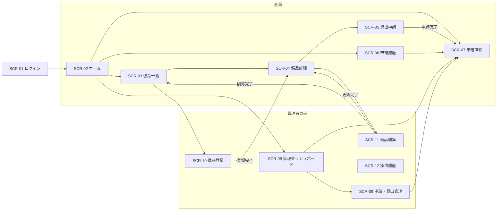

# 画面一覧・画面遷移・共通仕様

| 項目           | 内容                |
| -------------- | ------------------- |
| 文書バージョン | 0.1（ドラフト）     |
| 作成日         | 2026-09-13          |
| 作成者         | 開発チーム リーダー |

## 改訂履歴

| 版  | 日付       | 内容     | 作成者   |
| --- | ---------- | -------- | -------- |
| 0.1 | 2026-09-13 | 初版作成 | リーダー |

---

## 1. 画面一覧

| 画面ID                                       | 画面名             | URL                                   | 対象ロール   | 関連要件  |
| -------------------------------------------- | ------------------ | ------------------------------------- | ------------ | --------- |
| [SCR-01](screens/SCR-01_login.md)            | ログイン           | `/login`                              | 未ログイン   | FR-01     |
| [SCR-02](screens/SCR-02_home.md)             | ホーム             | `/`                                   | 全員         | FR-30     |
| [SCR-03](screens/SCR-03_equipment_list.md)   | 備品一覧           | `/equipment`                          | 全員         | FR-10     |
| [SCR-04](screens/SCR-04_equipment_detail.md) | 備品詳細           | `/equipment/[equipmentId]`            | 全員         | FR-11     |
| [SCR-05](screens/SCR-05_loan_request.md)     | 貸出申請           | `/equipment/[equipmentId]/request`    | 全員         | FR-20     |
| [SCR-06](screens/SCR-06_my_loans.md)         | 申請履歴           | `/my/loans`                           | 全員         | FR-21     |
| [SCR-07](screens/SCR-07_loan_detail.md)      | 申請詳細           | `/loans/[loanId]`                     | 本人・管理者 | FR-22〜27 |
| [SCR-08](screens/SCR-08_admin_dashboard.md)  | 管理ダッシュボード | `/admin`                              | 管理者       | FR-31     |
| [SCR-09](screens/SCR-09_admin_loans.md)      | 申請・貸出管理     | `/admin/loans`                        | 管理者       | FR-28     |
| [SCR-10](screens/SCR-10_equipment_new.md)    | 備品登録           | `/admin/equipment/new`                | 管理者       | FR-12     |
| [SCR-11](screens/SCR-11_equipment_edit.md)   | 備品編集           | `/admin/equipment/[equipmentId]/edit` | 管理者       | FR-13・14 |
| [SCR-12](screens/SCR-12_audit_logs.md)       | 操作履歴           | `/admin/audit-logs`                   | 管理者       | FR-33     |
| [SCR-90](screens/SCR-90_error.md)            | エラー             | （該当なし）                          | 全員         | FR-03     |

---

## 2. 画面遷移図



共通ヘッダーのメニューからは、各ロールが使えるすべての一覧画面へ移動できる（3.1 を参照）。

---

## 3. 全画面共通の仕様

### 3.1 共通ヘッダー

ログイン後のすべての画面の上部に表示する。

```
備品貸出管理システム   ホーム  備品一覧  申請履歴 | 管理ダッシュボード  申請・貸出管理  操作履歴     山田 太郎（開発部） [ログアウト]
                                                  └──────────── 管理者のみ表示 ────────────┘
```

| 要素                   | 動作                                                                                         |
| ---------------------- | -------------------------------------------------------------------------------------------- |
| システム名             | クリックするとホーム（`/`）へ移動する。                                                      |
| メニュー（全員）       | ホーム `/`、備品一覧 `/equipment`、申請履歴 `/my/loans`                                      |
| メニュー（管理者のみ） | 管理ダッシュボード `/admin`、申請・貸出管理 `/admin/loans`、操作履歴 `/admin/audit-logs`     |
| 現在地                 | 表示中の画面に対応するメニューを強調表示する。                                               |
| 利用者名               | 「氏名（部署）」を表示する。                                                                 |
| ログアウト             | `POST /api/auth/logout` を呼び、成功したらログイン画面へ移動する。確認ダイアログは出さない。 |

### 3.2 アクセス制御

アクセス制御は画面側（サーバー）と API の両方で行う（NFR-S-06）。

| 状況                                                 | 動作                                 |
| ---------------------------------------------------- | ------------------------------------ |
| 未ログインで、ログイン画面以外にアクセスした         | ログイン画面へリダイレクトする。     |
| ログイン済みで、ログイン画面にアクセスした           | ホームへリダイレクトする。           |
| 一般社員が `/admin` 以下にアクセスした               | SCR-90（403）を表示する。            |
| 存在しない URL にアクセスした                        | SCR-90（404）を表示する。            |
| 画面の操作中に API が 401 を返した（セッション切れ） | `/login?reason=expired` へ移動する。 |

ログイン後は常にホームへ移動する（ログイン前に開こうとしていた画面へ戻す機能は対象外）。

### 3.3 表示形式

| 対象                               | 形式                                       | 例               |
| ---------------------------------- | ------------------------------------------ | ---------------- |
| 日付                               | `YYYY/MM/DD`                               | 2026/09/13       |
| 日時                               | `YYYY/MM/DD HH:mm`（24時間表記、日本時間） | 2026/09/13 14:05 |
| 申請番号                           | `#` + 申請ID                               | #123             |
| 未設定の項目                       | `－`                                       |                  |
| 複数行のテキスト（説明・利用目的） | 入力された改行をそのまま表示する           |                  |

### 3.4 ステータスの表示

ステータスはバッジ（色付きのラベル）で表示する。色だけで区別せず、必ず文字を入れる（NFR-E-03）。

#### 申請のステータス

| 条件                  | 表示   | 色     |
| --------------------- | ------ | ------ |
| `pending`             | 申請中 | 黄     |
| `approved`            | 承認済 | 青     |
| `lent`（延滞でない）  | 貸出中 | 緑     |
| `lent`（延滞：BR-06） | 延滞   | 赤     |
| `returned`            | 返却済 | グレー |
| `rejected`            | 却下   | グレー |
| `cancelled`           | 取消   | グレー |

#### 備品の状態

| 条件                                  | 表示           | 色       |
| ------------------------------------- | -------------- | -------- |
| 状態が `suspended`                    | 貸出停止       | グレー   |
| 状態が `active` で、貸出可能数が0     | 在庫なし       | オレンジ |
| 状態が `active` で、貸出可能数が1以上 | （バッジなし） |          |

### 3.5 一覧とページング

- 1ページの件数は20件とする。
- 一覧の上に「全 N 件中 X〜Y 件」を表示する。0件のときは画面ごとに決めたメッセージを表示する。
- 一覧の下に「前へ」「次へ」ボタンと「現在のページ / 全ページ数」を表示する。最初のページでは「前へ」、最後のページでは「次へ」を押せなくする。
- **検索条件とページ番号は URL のクエリ文字列に保持する。** ページを再読み込みしたり URL を共有したりしても、同じ結果を表示できるようにする。
- 検索条件を変えて「検索」を押したら、1ページ目に戻す。

### 3.6 フォーム

- 必須項目のラベルには「必須」の目印を付ける。
- 入力チェックは、送信ボタンを押したときに画面側でも行い、エラーは各項目の下に赤字で表示する。
- API が `422 VALIDATION_ERROR` を返したときは、`details` に含まれる項目ごとのメッセージを各項目の下に表示する。
- 送信中は送信ボタンを押せなくし、ボタンの文言を「送信中…」にする（二重送信の防止）。

### 3.7 確認ダイアログ

状態を変える操作（申請の取消・承認・却下・貸出記録・返却記録、備品の削除）は、実行前に確認ダイアログを表示する。ダイアログには「実行するボタン」と「キャンセル」を置く。

### 3.8 メッセージ

#### 成功メッセージ

操作が成功したら、移動先（または同じ画面）の上部に緑色で表示する。閉じるボタンを付け、別の画面へ移動したら消す。

#### 共通のエラーメッセージ

| 状況                           | 表示するメッセージ                                               | 表示場所・動作                     |
| ------------------------------ | ---------------------------------------------------------------- | ---------------------------------- |
| API が 401 を返した            | セッションの有効期限が切れました。再度ログインしてください。     | ログイン画面に表示（3.2）          |
| API が 409 または 422 を返した | API が返した `error.message`                                     | 画面上部（項目ごとのエラーは 3.6） |
| API が 500 を返した            | サーバーでエラーが発生しました。時間をおいて再度お試しください。 | 画面上部                           |
| 通信に失敗した                 | 通信に失敗しました。ネットワーク接続を確認してください。         | 画面上部                           |

### 3.9 読み込み中の表示

データを取得している間は、表示領域に「読み込み中…」を表示する。
