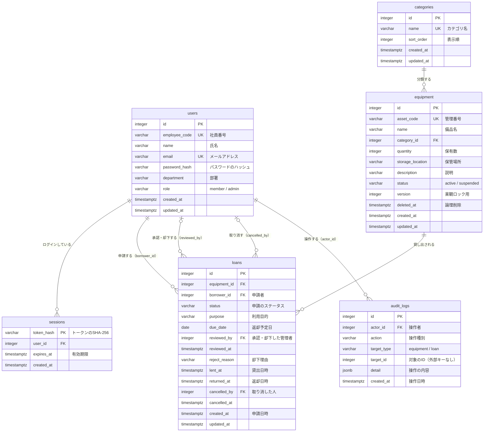

# ER図

| 項目           | 内容                |
| -------------- | ------------------- |
| 文書バージョン | 0.1（ドラフト）     |
| 作成日         | 2026-09-13          |
| 作成者         | 開発チーム リーダー |

## 改訂履歴

| 版  | 日付       | 内容     | 作成者   |
| --- | ---------- | -------- | -------- |
| 0.1 | 2026-09-13 | 初版作成 | リーダー |

---

## 1. ER図

カラムの詳細（桁数・制約・インデックス）は [05 テーブル定義書](05_table_definitions.md) を参照。

---

## 2. 設計上の判断

| No  | 判断                                                                      | 理由                                                                                                                                                                 |
| --- | ------------------------------------------------------------------------- | -------------------------------------------------------------------------------------------------------------------------------------------------------------------- |
| 1   | 在庫数（貸出可能数）をカラムに持たず、申請の件数から毎回計算する          | 在庫数を別に持つと、申請の件数と食い違う可能性がある。データの正は `loans` だけにする（BR-01）。                                                                     |
| 2   | 延滞をステータスとして保存しない                                          | 延滞は「日付が変わった」だけで発生するため、保存するとバッチ処理で更新し続ける必要がある。表示のたびに判定する（BR-06）。                                            |
| 3   | 申請から返却までを `loans` の1行で表し、各段階の日時をカラムに持つ        | 1件の貸出に起きる出来事は最大4つ（申請・承認・貸出・返却）で固定のため。「誰が操作したか」の完全な記録は `audit_logs` に任せる。                                     |
| 4   | 備品は論理削除（`deleted_at`）にする                                      | 過去の貸出申請が参照しているため、行を消すと貸出の記録が壊れる。                                                                                                     |
| 5   | 備品の同時編集は `version` カラムで検出する（楽観ロック）                 | 更新日時（`updated_at`）での比較は、PostgreSQL がマイクロ秒、JavaScript の `Date` がミリ秒で精度が異なり、一致判定を誤るため使わない。                               |
| 6   | `audit_logs.target_id` には外部キー制約を付けない                         | 対象が備品か申請かを `target_type` で切り替える（ポリモーフィック関連）ため、1つの外部キーでは表せない。操作履歴は削除も変更もしないので、参照先が消える心配もない。 |
| 7   | 操作履歴の `detail` に、操作した時点の備品名などを残す                    | 備品名が後で変わっても、「そのとき何に対して操作したか」が分かるようにするため。                                                                                     |
| 8   | ステータスは PostgreSQL の ENUM 型ではなく、`varchar` と CHECK 制約で表す | 値を追加するマイグレーションが簡単なため。                                                                                                                           |
