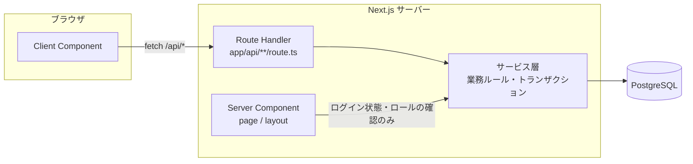

# API設計書

| 項目           | 内容                |
| -------------- | ------------------- |
| 文書バージョン | 0.1（ドラフト）     |
| 作成日         | 2026-09-13          |
| 作成者         | 開発チーム リーダー |

## 改訂履歴

| 版  | 日付       | 内容     | 作成者   |
| --- | ---------- | -------- | -------- |
| 0.1 | 2026-09-13 | 初版作成 | リーダー |

リクエスト・レスポンスの詳細なスキーマは [OpenAPI 定義（api/openapi.yaml）](api/openapi.yaml) を正とする。本書は、OpenAPI では表しにくい共通ルールと処理の仕様を定める。

---

## 1. アーキテクチャ方針



| 方針                                                | 内容                                                                                                                                                                                                 |
| --------------------------------------------------- | ---------------------------------------------------------------------------------------------------------------------------------------------------------------------------------------------------- |
| データの取得・更新は API 経由                       | 画面に表示するデータの取得と、すべての更新は、Client Component から `/api/*` を呼んで行う。                                                                                                          |
| Server Component から Route Handler を fetch しない | 同じサーバー内で余分な HTTP 通信が発生するため（Next.js 公式ドキュメントでも非推奨）。Server Component は、ログイン状態・ロールの確認（リダイレクトや 403 表示）のためにサービス層を直接呼んでよい。 |
| Server Actions は使わない                           | 更新処理の入口を Route Handler に一本化し、この API 設計書と OpenAPI 定義で仕様を管理するため。                                                                                                      |

### 層ごとの責務

| 層             | 責務                                                                                                        | 持たせないもの                                  |
| -------------- | ----------------------------------------------------------------------------------------------------------- | ----------------------------------------------- |
| Route Handler  | 認証・認可、`Origin` の検証、入力の検証、サービス層の呼び出し、エラーを HTTP ステータスとエラーコードに変換 | 業務ルール、SQL                                 |
| サービス層     | 業務ルール（BR-xx）、トランザクション、操作履歴の記録                                                       | HTTP（`Request`・`Response`・ステータスコード） |
| データアクセス | SQL の実行（ORM を含む）                                                                                    | 業務ルール                                      |

---

## 2. 共通仕様

### 2.1 基本

| 項目             | 仕様                                                                              |
| ---------------- | --------------------------------------------------------------------------------- |
| ベース URL       | `/api`                                                                            |
| 形式             | JSON（`Content-Type: application/json; charset=utf-8`）                           |
| プロパティ名     | キャメルケース（例：`assetCode`）。DB のスネークケースから変換して返す。          |
| ID               | 整数                                                                              |
| 日付（時刻なし） | `YYYY-MM-DD`。日本時間の暦日を表す（例：`2026-09-20`）。                          |
| 日時             | ISO 8601、UTC（例：`2026-09-13T05:05:00.000Z`）。日本時間への変換は画面側で行う。 |
| 値がない項目     | プロパティを省略せず `null` を返す。                                              |
| 文字列の入力     | 前後の空白を取り除いてから検証・保存する。                                        |

### 2.2 認証

- ログインに成功すると、セッショントークンを Cookie `session_token` に設定する（属性は NFR-S-03）。
- `POST /api/auth/login` 以外のすべての API は、有効なセッションが必要。ない場合は `401 UNAUTHENTICATED` を返す。

### 2.3 CSRF 対策

POST・PATCH・DELETE では、`Origin` ヘッダがアプリケーション自身のオリジンと一致しない場合に `403 FORBIDDEN` を返す（NFR-S-11）。

### 2.4 ページング

一覧を返す API は、次のクエリパラメータとレスポンス形式に従う。

| パラメータ | 型   | 既定値 | 範囲   |
| ---------- | ---- | ------ | ------ |
| `page`     | 整数 | 1      | 1以上  |
| `perPage`  | 整数 | 20     | 1〜100 |

```json
{
  "items": [],
  "pagination": {
    "page": 2,
    "perPage": 20,
    "totalCount": 123,
    "totalPages": 7
  }
}
```

- `page` が `totalPages` を超えた場合は、エラーにせず空の `items` を返す。
- 並び順が同じ値になる行があっても、ページをまたいで重複・欠落しないよう、並び順の最後に必ず `id` を加える。

### 2.5 複数の値を取るクエリパラメータ

カンマ区切りで指定する（例：`status=pending,approved`）。

### 2.6 キーワード検索

- 部分一致で、大文字・小文字を区別しない。
- 検索語に含まれる `%` と `_` はワイルドカードではなく、ただの文字として扱う（エスケープする）。

### 2.7 HTTP ステータスコード

| コード | 使う場面                                                                 |
| ------ | ------------------------------------------------------------------------ |
| 200    | 取得・更新に成功した                                                     |
| 201    | 作成に成功した（レスポンスに作成したリソースを入れる）                   |
| 204    | 成功し、返す内容がない（ログアウト、削除）                               |
| 400    | JSON として読めない                                                      |
| 401    | 未ログイン、セッション切れ、ログイン失敗                                 |
| 403    | 権限がない、`Origin` が不正、自分の申請を承認・却下しようとした          |
| 404    | リソースが存在しない、削除済み、閲覧する権限がない他人の申請（NFR-S-07） |
| 409    | 業務ルールに反する（在庫なし、状態遷移が不正、同時編集など）             |
| 422    | 入力値が不正（形式・必須・範囲）                                         |
| 500    | 想定外のエラー                                                           |

### 2.8 チェックの順番

1つのリクエストが複数のエラーに当てはまる場合は、次の順番で最初に当てはまったものを返す。

1. 認証（401）
2. `Origin` の検証・ロールの確認（403）
3. **パス**で指定したリソースの存在・閲覧権限（404）
4. 入力値の検証（422）
5. 業務ルール（リクエスト本文で指定したリソースの存在 404、403 `SELF_REVIEW_FORBIDDEN`、409）

例：`POST /api/loans` の `equipmentId` は本文で指定するため、入力値の検証（422）のあとに存在を確認する（4.2）。

### 2.9 エラーレスポンス

```json
{
  "error": {
    "code": "VALIDATION_ERROR",
    "message": "入力内容に誤りがあります。",
    "details": [
      { "field": "dueDate", "message": "返却予定日は明日から30日後までの日付を指定してください" }
    ]
  }
}
```

- `message` は、そのまま画面に表示できる日本語にする。
- `details` は `VALIDATION_ERROR` のときだけ入れる。`field` はリクエストのプロパティ名（クエリパラメータの場合はパラメータ名）。
- スタックトレース・SQL・内部のファイルパスは含めない（NFR-S-12）。

### 2.10 エラーコード一覧

| HTTP | `code`                        | `message`                                                                                            | 主な発生元                                  |
| ---- | ----------------------------- | ---------------------------------------------------------------------------------------------------- | ------------------------------------------- |
| 400  | `BAD_REQUEST`                 | リクエストの形式が正しくありません。                                                                 | 全 API                                      |
| 401  | `UNAUTHENTICATED`             | ログインが必要です。                                                                                 | 全 API                                      |
| 401  | `INVALID_CREDENTIALS`         | メールアドレスまたはパスワードが正しくありません。                                                   | ログイン                                    |
| 403  | `FORBIDDEN`                   | この操作を行う権限がありません。                                                                     | 管理者向け API、更新系 API（`Origin` 不正） |
| 403  | `SELF_REVIEW_FORBIDDEN`       | 自分の申請は承認・却下できません。                                                                   | 承認・却下                                  |
| 404  | `NOT_FOUND`                   | 対象のデータが見つかりません。                                                                       | ID を指定する API                           |
| 409  | `ASSET_CODE_ALREADY_EXISTS`   | この管理番号は既に使用されています。                                                                 | 備品登録                                    |
| 409  | `EDIT_CONFLICT`               | 他の管理者がこの備品を更新しました。画面を再読み込みして、最新の内容を確認してから編集してください。 | 備品編集                                    |
| 409  | `QUANTITY_BELOW_ACTIVE_LOANS` | 保有数は現在の引当数（{引当数}）以上にしてください。                                                 | 備品編集                                    |
| 409  | `EQUIPMENT_HAS_ACTIVE_LOANS`  | 未完了の申請があるため、この備品は削除できません。                                                   | 備品削除                                    |
| 409  | `OUT_OF_STOCK`                | 貸出可能な在庫がありません。                                                                         | 貸出申請                                    |
| 409  | `DUPLICATE_ACTIVE_LOAN`       | この備品は既に申請中または貸出中です。申請履歴を確認してください。                                   | 貸出申請                                    |
| 409  | `EQUIPMENT_SUSPENDED`         | この備品は貸出停止中のため申請できません。                                                           | 貸出申請                                    |
| 409  | `INVALID_STATUS_TRANSITION`   | この申請は他の操作によって状態が変わっています。最新の状態を確認してください。                       | 申請の状態変更                              |
| 422  | `VALIDATION_ERROR`            | 入力内容に誤りがあります。                                                                           | 入力を受け取る API                          |
| 500  | `INTERNAL_SERVER_ERROR`       | サーバーでエラーが発生しました。時間をおいて再度お試しください。                                     | 全 API                                      |

---

## 3. エンドポイント一覧

| メソッド | パス                           | 概要                     | ロール       | 関連要件  | 使う画面       |
| -------- | ------------------------------ | ------------------------ | ------------ | --------- | -------------- |
| POST     | `/api/auth/login`              | ログイン                 | 不要         | FR-01     | SCR-01         |
| POST     | `/api/auth/logout`             | ログアウト               | 全員         | FR-02     | 共通ヘッダー   |
| GET      | `/api/auth/me`                 | ログイン中の社員の情報   | 全員         | FR-03     | 共通ヘッダー   |
| GET      | `/api/categories`              | カテゴリ一覧             | 全員         | FR-10・12 | SCR-03・10・11 |
| GET      | `/api/equipment`               | 備品一覧・検索           | 全員         | FR-10     | SCR-03         |
| POST     | `/api/equipment`               | 備品登録                 | 管理者       | FR-12     | SCR-10         |
| GET      | `/api/equipment/{equipmentId}` | 備品詳細                 | 全員         | FR-11     | SCR-04・05・11 |
| PATCH    | `/api/equipment/{equipmentId}` | 備品編集                 | 管理者       | FR-13     | SCR-11         |
| DELETE   | `/api/equipment/{equipmentId}` | 備品削除                 | 管理者       | FR-14     | SCR-11         |
| POST     | `/api/loans`                   | 貸出申請                 | 全員         | FR-20     | SCR-05         |
| GET      | `/api/loans`                   | 申請一覧（全社員）       | 管理者       | FR-28     | SCR-04・08・09 |
| GET      | `/api/me/loans`                | 自分の申請一覧           | 全員         | FR-21・30 | SCR-02・06     |
| GET      | `/api/loans/{loanId}`          | 申請詳細                 | 本人・管理者 | FR-22     | SCR-07         |
| POST     | `/api/loans/{loanId}/approve`  | 承認                     | 管理者       | FR-24     | SCR-07         |
| POST     | `/api/loans/{loanId}/reject`   | 却下                     | 管理者       | FR-25     | SCR-07         |
| POST     | `/api/loans/{loanId}/cancel`   | 取消                     | 本人・管理者 | FR-23     | SCR-07         |
| POST     | `/api/loans/{loanId}/lend`     | 貸出記録                 | 管理者       | FR-26     | SCR-07         |
| POST     | `/api/loans/{loanId}/return`   | 返却記録                 | 管理者       | FR-27     | SCR-07         |
| GET      | `/api/dashboard`               | 管理ダッシュボードの集計 | 管理者       | FR-31     | SCR-02・08     |
| GET      | `/api/audit-logs`              | 操作履歴一覧             | 管理者       | FR-33     | SCR-12         |

申請の状態変更を `PATCH /api/loans/{loanId}`（`status` を書き換える形）にせず、操作ごとにエンドポイントを分けているのは、操作ごとに必要な権限・入力（却下理由など）・操作履歴が異なるため。

---

## 4. 処理の仕様

### 4.1 貸出可能数・延滞の計算

| 項目                              | 計算方法                                                                               |
| --------------------------------- | -------------------------------------------------------------------------------------- |
| `activeLoanCount`（引当数）       | その備品の `loans` のうち、`status IN ('pending', 'approved', 'lent')` の件数（BR-01） |
| `availableQuantity`（貸出可能数） | `quantity − activeLoanCount`。貸出停止中の備品も同じ式で計算する。                     |
| `isOverdue`（延滞）               | `status = 'lent'` かつ `due_date < 今日（日本時間）`（BR-06）                          |
| `isDueSoon`（返却期限間近）       | `status = 'lent'` かつ `今日 ≦ due_date ≦ 今日＋3日`（日本時間。BR-15）                |

「今日」はサーバーのタイムゾーン設定に関係なく、日本時間で求める（NFR-E-04）。

### 4.2 POST /api/loans（貸出申請）

同時に申請されても引当数が保有数を超えないこと（BR-02）が最重要の要件。次の手順を**1つのトランザクション**で行う。

1. 入力を検証する（`dueDate` が翌日〜30日後か：BR-05）。
2. 対象の備品の行を**ロックして**取得する（`SELECT ... FOR UPDATE`）。存在しない・削除済みなら `404 NOT_FOUND`。
3. 備品が `suspended` なら `409 EQUIPMENT_SUSPENDED`（BR-10）。
4. 同じ社員の未完了の申請があれば `409 DUPLICATE_ACTIVE_LOAN`（BR-04）。
5. 引当数を数え、貸出可能数が0なら `409 OUT_OF_STOCK`（BR-02）。
6. `loans` に `status = 'pending'` で INSERT する。
7. `audit_logs` に `loan.request` を INSERT する（BR-14）。

手順2のロックにより、同じ備品への申請は1件ずつ順番に処理される。ロックせずに「数えてから INSERT」すると、2つのリクエストが同時に「残り1」と数えて両方とも INSERT してしまう。

### 4.3 申請の状態変更（approve / reject / cancel / lend / return）

1. 申請を取得する。一般社員が他人の申請を指定した場合は `404 NOT_FOUND`（NFR-S-07）。
2. 操作する権限を確認する（下表）。
3. 状態遷移表（BR-07）で、現在の状態からその操作ができるかを確認する。できなければ `409 INVALID_STATUS_TRANSITION`。
4. **更新の条件に現在の状態を含めて** UPDATE する（例：`UPDATE loans SET status = 'approved', ... WHERE id = $1 AND status = 'pending'`）。更新件数が0なら、他の管理者が先に処理したとみなして `409 INVALID_STATUS_TRANSITION` を返す。
5. `audit_logs` に記録する（2〜5 は1つのトランザクション）。

| 操作    | 操作できる人                                                       | 前の状態              | 次の状態    | 設定するカラム                                |
| ------- | ------------------------------------------------------------------ | --------------------- | ----------- | --------------------------------------------- |
| approve | 管理者。申請者本人なら `403 SELF_REVIEW_FORBIDDEN`（BR-08）        | `pending`             | `approved`  | `reviewed_by`、`reviewed_at`                  |
| reject  | 管理者。申請者本人なら `403 SELF_REVIEW_FORBIDDEN`（BR-08）        | `pending`             | `rejected`  | `reviewed_by`、`reviewed_at`、`reject_reason` |
| cancel  | 申請者本人（`pending`・`approved`）、管理者（`approved`）（BR-16） | `pending`・`approved` | `cancelled` | `cancelled_by`、`cancelled_at`                |
| lend    | 管理者                                                             | `approved`            | `lent`      | `lent_at`                                     |
| return  | 管理者                                                             | `lent`                | `returned`  | `returned_at`                                 |

- 一般社員が approve・reject・lend・return を呼んだ場合は、ロールの確認で `403 FORBIDDEN` を返す（2.8 の順番）。
- 管理者が他人の `pending` の申請に cancel を呼んだ場合は `409 INVALID_STATUS_TRANSITION` を返す（管理者は却下を使う）。

### 4.4 allowedActions

`GET /api/loans/{loanId}` と、状態変更 API のレスポンスには `allowedActions` を含める。**ログイン中の利用者が、その申請に今実行できる操作**の一覧で、4.3 の権限と状態遷移表から計算する。画面はこの値でボタンの表示を決める（[SCR-07](screens/SCR-07_loan_detail.md)）。業務ルールの判定をサーバーの1か所にまとめるための仕組み。

### 4.5 PATCH /api/equipment/{equipmentId}（備品編集）

1. リクエストの `version` と DB の `version` が異なれば `409 EDIT_CONFLICT`（FR-13）。
2. `quantity` を変える場合、新しい値が引当数より小さければ `409 QUANTITY_BELOW_ACTIVE_LOANS`（BR-12）。引当数を数える前に備品の行をロックする（4.2 と同じ理由）。
3. 更新時に `version` を1増やし、`updated_at` を現在時刻にする。
4. 変更された項目を `audit_logs` に `equipment.update` として記録する（[05 テーブル定義書 3.6](05_table_definitions.md#36-audit_logs操作履歴)）。値が1つも変わらなかった場合は、更新も記録もせずに現在の内容を返す。

### 4.6 DELETE /api/equipment/{equipmentId}（備品削除）

1. 備品の行をロックする。
2. 引当数が1以上なら `409 EQUIPMENT_HAS_ACTIVE_LOANS`（BR-11）。
3. `deleted_at` に現在時刻を入れる（論理削除）。
4. `audit_logs` に `equipment.delete` を記録する。

削除した備品は、`GET /api/equipment` の一覧・`GET /api/equipment/{equipmentId}` の対象外になる（404）。一方、申請の `equipment` には削除後も表示する（過去の貸出記録のため）。

### 4.7 一覧の並び順

| API                   | 並び順                                                                                    |
| --------------------- | ----------------------------------------------------------------------------------------- |
| `GET /api/equipment`  | `asset_code` 昇順                                                                         |
| `GET /api/me/loans`   | `created_at` 降順、`id` 降順                                                              |
| `GET /api/loans`      | `overdue=true` のとき `due_date` 昇順、`id` 昇順。それ以外は `created_at` 降順、`id` 降順 |
| `GET /api/audit-logs` | `created_at` 降順、`id` 降順                                                              |
| `GET /api/categories` | `sort_order` 昇順、`id` 昇順                                                              |

### 4.8 GET /api/audit-logs の期間指定

- `from` は、その日の 00:00:00（日本時間）以降を含む。
- `to` は、その日の 23:59:59（日本時間）までを含む。実装では「`to` の翌日 00:00:00（日本時間）より前」で比較する。
- `from` が `to` より後なら `422 VALIDATION_ERROR`（`field`: `from`）。
